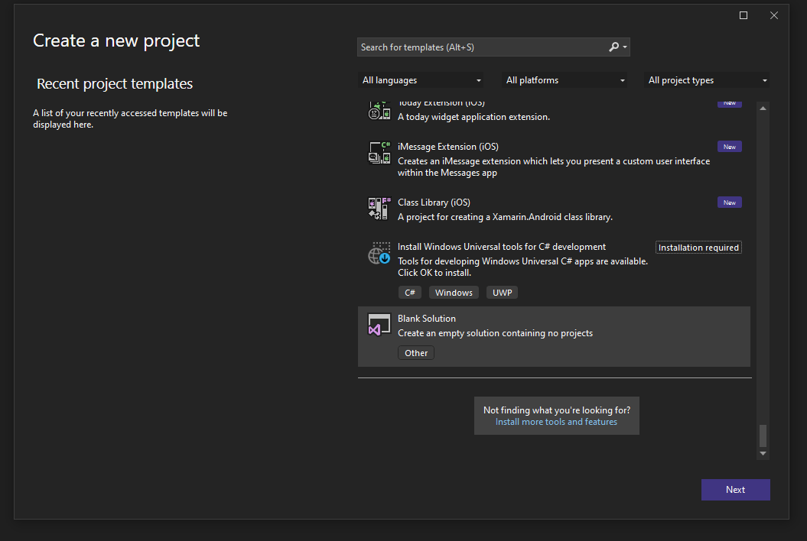
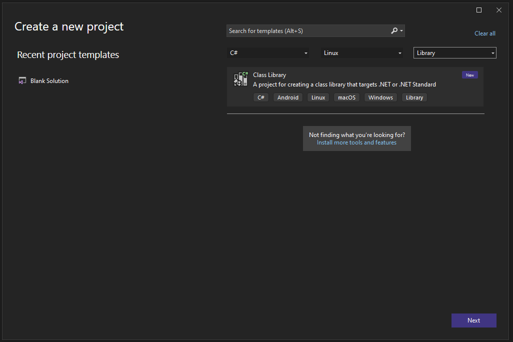
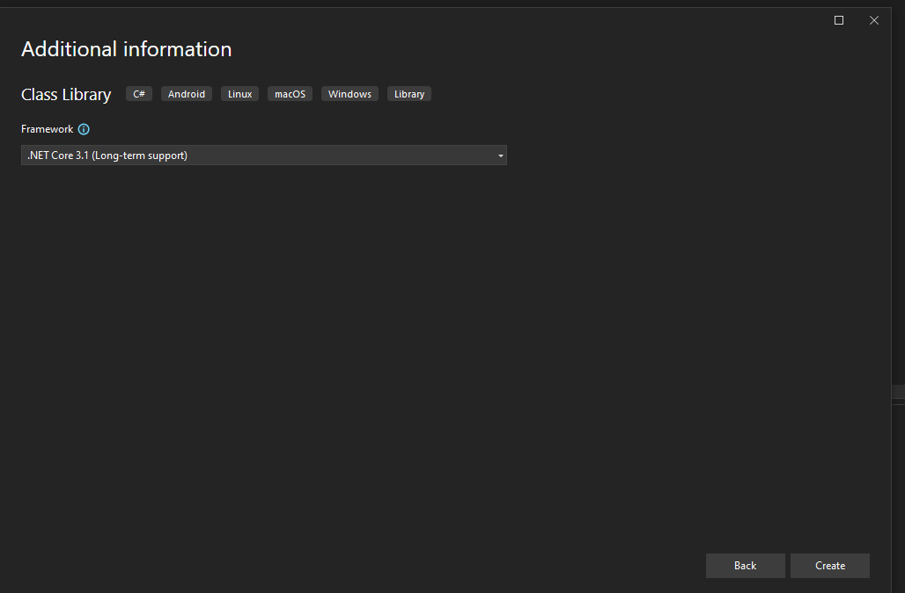
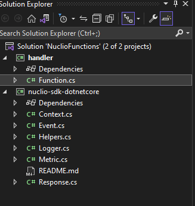
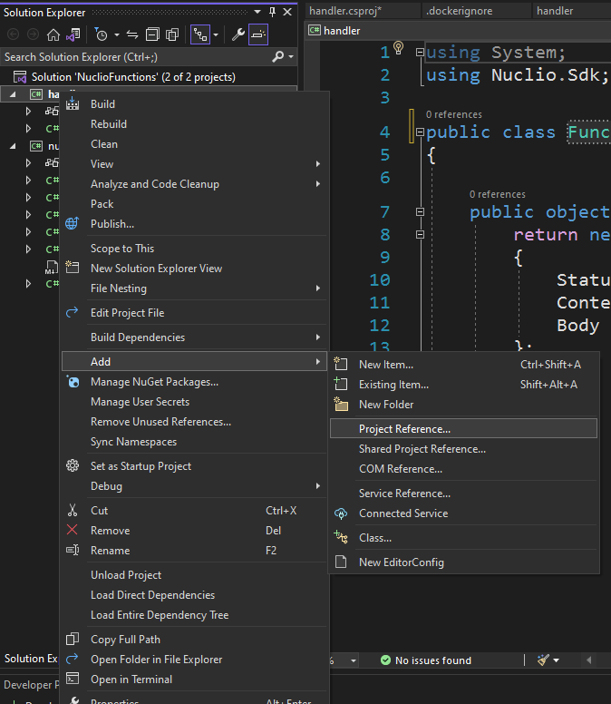
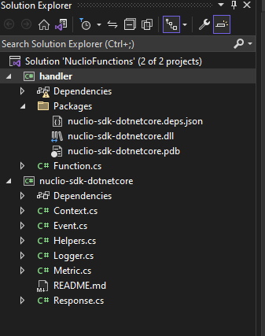
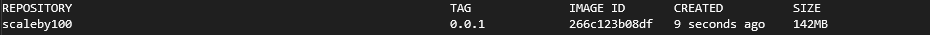

# Building a Nuclio Function Container Using C# and .NET Core 3.1 - Part 1

by Greg Lusk

# Background

Out of the box, Nuclio supports building function containers through its Dashboard interface.  You can deploy code using several languages, including C#.  When doing so, the Nuclio build system on the server will accept the code and build a Docker container that runs your code as a single function.  One of the drawbacks of this approach, however, is that it's not possible to include third-party dependencies in the code that you send.

In order to provide third-party library support, you must compile your own Docker container with the functions that you write.  This is essentially what takes place on the server when you deploy code, except that you are doing it external to the server on your own development machine; afterward, you simply deploy the container to the server. 

This document describes the process of building a function container outside the Nuclio runtime and deploying it to a Nuclio server.

# Prerequisites

* Visual Studio 2022
* .NET Core 3.1 SDK
* Git
* Docker daemon
* A running Nuclio server, version 1.9.3

# Create a new .NET Core project

Let's start by creating an empty solution that will contain all of the C# projects for the containerized functions that we will build. We will call the solution "NuclioFunctions".



Next, add a new project whose type is C# library for Linux, and call it *handler* 

**Note: You MUST name the project 'handler' for the entire process of building a containerized function to work correctly.  I'll explain later why this is the case.**



When building our function, we will target the .NET 3.1 runtime. Follow the wizard steps in Visual Studio and verify that the Framework version is .NET Core 3.1 (Long-term support):



# Build and distribute Nuclio.Sdk

A Nuclio function must satisfy certain interface requirements. The Nuclio team has provided C# classes that can be used to satisfy the interface and our function library must reference these classes in order to work properly when we deploy it to the server. 

Later in this tutorial, we will describe how to create a Dockerfile that contains instructions for building the container for your function. During the process of building the container image, Docker will use the .NET SDK to compile our code and link to the Nuclio.Sdk assembly. But we also want to be able to compile our project from Visual Studio without having to build the Docker image. So we will clone the repository that contains the Nuclio.Sdk source code and build it as part of our solution. Then we will reference the resulting assembly through a project reference in Visual Studio code (note that the latter step is exactly what will be accomplished in the Dockerfile that we will create later).

Open a command prompt and navigate to the directory where you created the Visual Studio solution. Then type the following command:

`git clone https://github.com/nuclio/nuclio-sdk-dotnetcore.git`

When Git is finished cloning the repository, add it to your solution by  right-clicking on the solution and selecting *Add/Existing Project*. Select the .csproj file that is inside the *nuclio-sdk-dotnetcore* folder. Your Solution Explorer pane should look something like this now:



Next, create a Project reference to the *nuclio-sdk-dotnetcore* project in the **handler** function container project:



Select the *nuclio-sdk-dotnetcore* project and click OK.

## A Better Way to Reference *nuclio-sdk-dotnetcore*

Now that we have built the *nuclio-sdk-dotnetcore* assembly, we  really don't need it in our project any more; we just need a reference to it.  So let's create a Packages folder in our function library project and put the *nuclio-sdk-dotnetcore* assembly there so that we can reference it.  That way, we don't have to keep it in our solution and we can just use the compiled assembly.

Copy the DLL file from the *bin/Debug* folder in the *nuclio-sdk-dotnetcore* project to the Package folder in the function library project.  Your Solution Explorer should look something like this now:



Now right-click and remove the *nuclio-sdk-dotnetcore*  project, leaving only the function container project.

Finally, add a reference to the *nuclio-sdk-dotnetcore* assembly that is located in the Package folder.

## Write the Function Code

When we created our function container project originally, Visual Studio Code created a default class file named  *Class1.cs*. Let's rename that file to *Function.cs*.

Now add the following code to the *Function.cs* file:

```csharp
using System;
using Nuclio.Sdk;

public class Function
{
    public object execute(Context context, Event eventBase){
        return new Response()
        {
            StatusCode = 200,
            ContentType = "application/text",
            Body = ""
        };
    }
}


```

Notice that we don't include a namespace here, as that's not required for Nuclio to run the function. The `execute()` function is the handler that will be run when the function is triggered by an event on the Nuclio server. For now, the body of the handler will just return a 200 HTTP status code with an empty body for a response.

Note that the function signature for `execute()` takes two arguments. These classes are defined in the `Nuclio.Sdk` namespace with is provided by the *nuclio-sdk-dotnetcore* assembly.   Later, these class instances will contain data that we will use as inputs to our calculation

Compile the project and ensure that there are no errors.

# Create a Docker file

Next, we will add a Dockerfile to our project so that we can instruct Docker on how to build the function container image.

Right-click on the *handler* project in the Solution Explorer and add a new text file; name it Dockerfile.txt and then rename it by removing the *.txt* extension.  This is standard naming for a Docker file.

Copy and paste the following code into the Dockerfile:

```bash
ARG NUCLIO_LABEL=1.9.3
ARG NUCLIO_ARCH=amd64
ARG NUCLIO_BASE_IMAGE=mcr.microsoft.com/dotnet/runtime:3.1-alpine3.15
ARG NUCLIO_ONBUILD_IMAGE=quay.io/nuclio/handler-builder-dotnetcore-onbuild:${NUCLIO_LABEL}-${NUCLIO_ARCH}

# Supplies processor uhttpc, used for healthcheck
FROM nuclio/uhttpc:0.0.1-amd64 as uhttpc

# Builds source, supplies processor binary and handler plugin
FROM ${NUCLIO_ONBUILD_IMAGE} as builder

RUN /bin/bash  -c echo  ${NUCLIO_BUILD_LOCAL_HANDLER_DIR}

# From the base image
FROM ${NUCLIO_BASE_IMAGE}

# Copy required objects from the suppliers
COPY --from=builder /home/nuclio/bin/processor /usr/local/bin/processor
COPY --from=builder /home/nuclio/bin/wrapper /opt/nuclio/wrapper
COPY --from=builder /home/nuclio/bin/handler /opt/nuclio/handler
COPY --from=builder /home/nuclio/src/nuclio-sdk-dotnetcore /opt/nuclio/nuclio-sdk-dotnetcore
COPY --from=uhttpc /home/nuclio/bin/uhttpc /usr/local/bin/uhttpc


# Readiness probe
HEALTHCHECK --interval=1s --timeout=3s CMD /usr/local/bin/uhttpc --url http://127.0.0.1:8082/ready || exit 1

# Run processor with configuration and platform configuration
CMD [ "processor" ]

```
The container image that results from this Dockerfile will be based on an image that is published by the Nuclio team.  It is designed to clone the source code for the *nuclio-sdk-dotnetcore* library, compile it, and link it to our project (exactly as we did manually in earlier steps). It is also designed to build our *handler* project and use our *Function* class as the entry point for the function. 

This Dockerfile is an updated version of the one found at <https://nuclio.io/docs/latest/reference/runtimes/dotnetcore/dotnetcore-reference/>. It uses the .NET Core 3.1 runtime image for Linux Alpine and also references a more recent version of the Nuclio builder Docker image (we chose 1.9.3 because that is the same version as the Nuclio server that we are running).

# Add a .dockerignore File

Before we can build our project with Docker we need to tell Docker to ignore the *nuclio-sdk-dotnetcore* file in the Package folder. This is because in the builder base image that our container image is based on, the *nuclio-sdk-dotnetcore* assembly is compiled and provided for us.  If we don't tell Docker to ignore this file in the Package folder, the .NET compiler will return an error.

So let's create a text file in our project and call it *.dockerignore.txt* and again rename it to remove the extension. Put the following entry in the resulting file:

`Package/nuclio-sdk-dotnetcore.dll`

# Build the Image

Now it's time to build the image using Docker. Open a terminal window in Visual Studio, switch to the folder that contains the *handler* project and type the following command:

`docker build -t scaleby100:0.0.1 .`

This command instructs Docker to build the image, tag it with the name `scaleby100` and use the current folder as the context. 

If all goes well, you should see a lot of build output followed by this message:

```bash
Successfully built <the SHA hash of the image>
Successfully tagged scaleby100-1:latest
```

When the image is built successfully, you should see it located in your local Docker registry. To check the registry contents type:

`docker images`

from a command prompt.  The new image should be listed:



In the next tutorial, we will use the `nuctl` CLI to deploy the function container that we built.

# Troubleshooting

I ran into several pitfalls while trying to get this to work. Here are some of the things to check if your project does not build correctly.

## Invalid Project File Name

I spent a lot of time and effort before figuring out that my project file  *MUST* be named `handler.csproj`.  If the file name is anything different, when you run the `docker build` command, the code for your project will be copied to the `/home/nuclio/src/handler` folder the image. When Docker invokes the .NET compiler, the compiler will reply with the following message, indicating that it does not know which project to compile:

`Found  more than one project in '/home/nuclio/src/handler'. Specify which one to use.`

This is because the base image for the container already contains a default file named `handler.csproj` in the /home/nuclio/src/handler` path.  So if a second project is copied there, then the compile doesn't know which one to build when Docker issues the `dotnet restore` command.

However, if you name your project *handler.csproj*, in Visual Studio, then the existing default *handler.csproj* file is overwritten and your project will be compiled instead.

## Getting the Right Builder Base Image

It took me a while to find the correct base image for the `builder` layer. In the documentation located at

<https://nuclio.io/docs/latest/reference/runtimes/dotnetcore/dotnetcore-reference/>

The Dockerfile that you are instructed to use looks like this:

```bash
ARG NUCLIO_LABEL=0.5.6
ARG NUCLIO_ARCH=amd64
ARG NUCLIO_BASE_IMAGE=microsoft/dotnet:2-runtime
ARG NUCLIO_ONBUILD_IMAGE=nuclio/handler-builder-dotnetcore-onbuild:${NUCLIO_LABEL}-${NUCLIO_ARCH}

# Supplies processor uhttpc, used for healthcheck
FROM nuclio/uhttpc:0.0.1-amd64 as uhttpc

# Builds source, supplies processor binary and handler plugin
FROM ${NUCLIO_ONBUILD_IMAGE} as builder

# From the base image
FROM ${NUCLIO_BASE_IMAGE}

# Copy required objects from the suppliers
COPY --from=builder /home/nuclio/bin/processor /usr/local/bin/processor
COPY --from=builder /home/nuclio/bin/wrapper /opt/nuclio/wrapper
COPY --from=builder /home/nuclio/bin/handler /opt/nuclio/handler
COPY --from=builder /home/nuclio/src/nuclio-sdk-dotnetcore /opt/nuclio/nuclio-sdk-dotnetcore
COPY --from=uhttpc /home/nuclio/bin/uhttpc /usr/local/bin/uhttpc

# Readiness probe
HEALTHCHECK --interval=1s --timeout=3s CMD /usr/local/bin/uhttpc --url http://127.0.0.1:8082/ready || exit 1

# Run processor with configuration and platform configuration
CMD [ "processor" ]

```

However, this does not match the version of Nuclio that we are running on our server.  So the resulting `builder` layer will be out of date because version 0.5.6 targets the .NET Core SDK 2 instead of .NET Core SDK 3.1.

To fix this, the `NUCLIO_LABEL` build argument had to be changed to the version that matches the one that you are running on the server. In the case of this tutorial, it's `1.9.3`.

Also, the version of the .NET Runtime specified in the `NUCLIO_BASE_IMAGE` build argument is outdated. Since Nuclio 1.9.3 supports .NET Core 3.1, we had to change the 'NUCLIO_BASE_IMAGE' argument to: 

`mcr.microsoft.com/dotnet/runtime:3.1-alpine3.15`

## Finding Official Container Images

It was very confusing at first when I was following the sparse documentation on building a function container using .NET; the examples all referenced very old images on Docker Hub, but I discovered later that the Nuclio team now publishes official container images on `quay.io`. So for every official release, you can find corresponding container images for the builder base image at:

<https://quay.io/repository/nuclio/handler-builder-dotnetcore-onbuild?tab=tags>

Generally, all the container images that are published by the Nuclio team can be found at:

<https://quay.io/user/nuclio>

