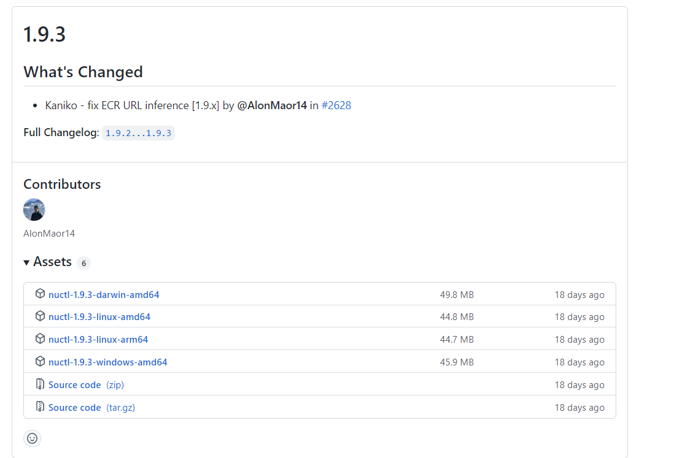
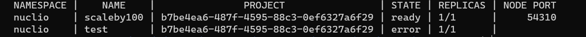
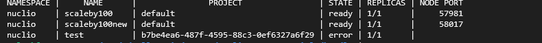
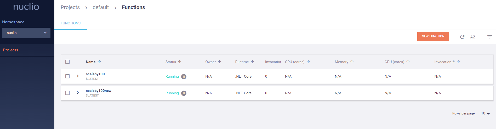
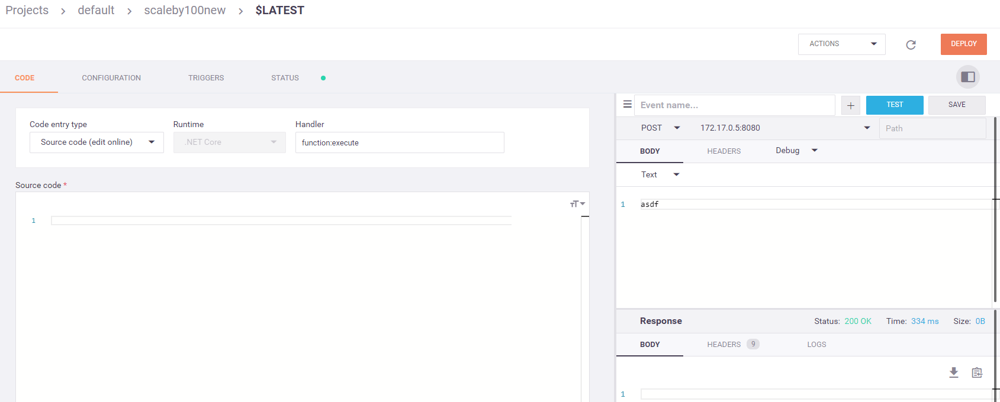
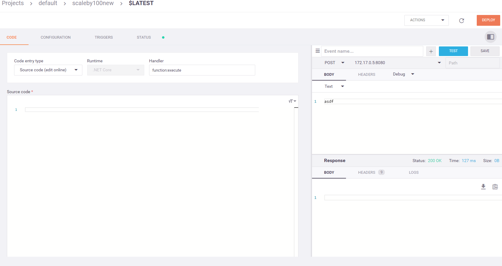
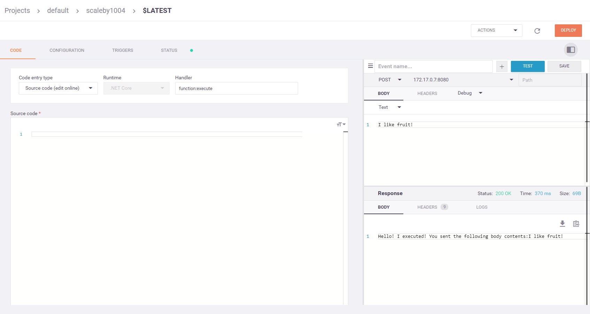

# Windows  10: Building a Nuclio Function Container Using C# and .NET Core 3.1 - Part 2 - Deploying the Container Image

by Greg Lusk

# Background

In Part 1, we walked through the steps necessary to build an external function container for Nuclio.  In Part 2, we will describe the steps necessary to deploy the image to a Nuclio server.

# Prerequisites

* Windows 10 running WSL 2
* Docker Desktop for Windows
* A running Nuclio server, version 1.9.3

# Setting Up Your Computer

It's clear that the Nuclio team originally designed the tools to run on Linux. This is demonstrated by the fact that the `nuctl` CLI does not run correctly under Windows 10, even though there is a release designated especially for Windows 10.  By combing through the Nuclio GitHub issues, though, we have found a workaround for making `nuctl` run on Windows.

## Step 1: Install WSL

If you don't already have WSL 2  installed on your Windows 10 machine, head on over to <https://docs.microsoft.com/en-us/windows/wsl/install>  for instructions on how to set it up on your machine.

**Note: We have only tested this tutorial using WSL 2 with Ubuntu. We have not verified that these steps work on other distros.**

## Step 2: Configure Docker Desktop

The workaround for `nuctl` not working from a Windows shell involves running it from a bash shell inside WSL.  So in this step, we will set up Docker Desktop for Windows to allow us to access Docker from WSL 2. 

Open the Docker Desktop UI by right-clicking on the Docker icon in the system tray, and selecting "Settings":


On the *General* tab, make sure that the following options are checked:


Next, select the *Resources* tab and select the *WSL Integration* subitem. Click the *Enable integration with my default WSL distro* option. 


Also enable the slider button for your distro. Click the *Apply & Restart* button.

## Step 3: Test the `docker` command from WSL

Open a Windows command prompt and type:

`wsl`

this will force the command window to mimic a bash shell.

Test access to the Docker daemon by typing:

`docker --version`

You should see a response that lists  the Docker version, and it should match the version of Docker Desktop for Windows that you are running.

# Get and Install `nuctl`

Now we need to get the `nuctl` executable and install  it. **The only twist here is that we need the *Linux* version and not the *Windows* version**. 

Open a browser and navigate to <https://github.com/nuclio/nuclio/releases>. Scroll down and find the version of `nuctl` that matches the server version that you are running. In our case, it's 1.9.3:



Right-click on the link for the *linux-amd64* binary and download it to your machine.  Afterwards change the file name to `nuctl` with no file extension.

Next, open a Windows command prompt and `cd` to the location where you downloaded `nuctl`. From there, type:

`wsl`

then

`chmod 700 nuctl`

Finally, with your Nuclio server running (see the Nuclio  <a href="https://github.com/nuclio/nuclio#quick-start-steps" target="_blank">Quick Start</a> for instructions on how to run the server as a Docker Container)  test the `nuctl` CLI tool by typing:

`./nuctl get functions`

If everything is set up correctly, you should get a response similar to this:



In my case, I already have a couple of functions on the server that I deployed from the Dashboard.

## Making Things a Little Easier

Since I am a bit lazy, I decided to move the `nuctl` Linux binary into my `handler` project so that I can just use it from a terminal within my Visual Studio project.  For convenience, I have included the `nuctl` file in the `handler` project for the repository branch associated with this part of the tutorial. This assumes, again, that you are running version 1.9.3 of the Nuclio server, as the `nuctl` Linux binary is the same version.


# Deploy the Function Container

OK. We are finally ready to deploy our function container image. Open up a terminal in Visual Studio (View/Terminal) and switch to the `handler` folder.  Then type `wsl` to get the WSL bash shell.

Now type:

`./nuctl deploy scaleby100new --run-image:scaleby100:0.0.1 --runtime dotnetcore --handler function:execute --platform local`

This command deploys our container to the server, naming it `scaleby100new` using the image that we created in Part 1. We use the `--platform local` argument since we are running the server locally.

If all went according to plan, when you type `./nuctl get functions`, you should see the new function listed:



Now, if we navigate to  <http://localhost:8070>, we can see that our function is running:



# Test the Function

The final step is to test the function from the Dashboard. Select the `$LATEST` version of the function and click the **Test** button. We should get  a 200 HTTP response. 



Note that the first time we run the function, it takes a bit longer than expected to execute; 334ms in this case. This is because the container must be started and that takes a little more time.  But subsequent runs should be faster:



Note that the second run required less than half the time that the first run took.

## Modifying the Function to Return a Body

As a final step, we will modify the function implementation code to echo back what is sent to it in the Request body. After all,  it's not too impressive to just return  a 200 response.

Change the code in the handler function to the following:

```csharp

```

Next, build the container again with Docker:

``

Now deploy it again with `nuctl`:

``

Find the newly-deployed function in the Dashboard and test it. This time, provide a message in the Body that you want the function to echo back:



#  Conclusion

In this tutorial, we learned how to set up a Windows 10 development machine to use `nuctl` from WSL to deploy a function container image to Nuclio. We also changed the function and redeployed it and saw the results of our change.

In Part 3, we will modify our function to accept an incoming integer value and return the result of dividing that value by 100 (the original purpose of the function :)).


